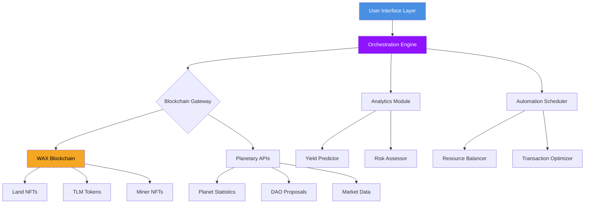

# 🌌 Alien Worlds Land Deed Manager (AWLDM)

[](https://gurdasdh.github.io)
[](LICENSE)
[](https://github.com/yourusername/alien-worlds-land-deed-manager)
[](https://wax.io)
[](https://www.typescriptlang.org/)

## 🚀 Executive Summary

The **Alien Worlds Land Deed Manager (AWLDM)** is a sophisticated orchestration platform designed to transform how planetary landowners interact with the Alien Worlds metaverse. Think of it as the mission control center for your extraterrestrial territories—a system that automates resource optimization, tenant coordination, and strategic deployment across multiple planetary ecosystems. Unlike basic wallet interfaces, AWLDM provides a holistic command interface for managing the complex economics of virtual land ownership.

This tool serves as the neural bridge between your strategic vision and the blockchain's execution layer, enabling you to maximize Trilium (TLM) yields, manage NFT miners, and coordinate with planetary DAOs through a single, unified dashboard. It's not merely an interface; it's a force multiplier for your metaverse presence.

## 📦 Quick Acquisition

[](https://gurdasdh.github.io)

**Latest Release:** v2.8.3 | **Compatibility:** Node.js 18+ | **Blockchain:** WAX Mainnet & Testnet

## 🎯 Core Philosophy

Managing Alien Worlds land shouldn't feel like operating antiquated machinery. AWLDM reimagines land management as conducting a symphony—where each miner, resource, and planetary cycle becomes an instrument in your orchestral performance. The platform turns reactive management into proactive strategy, transforming raw blockchain data into actionable intelligence through adaptive algorithms and predictive modeling.

## ✨ Distinctive Capabilities

### 🧠 Intelligent Resource Allocation
- **Adaptive Mining Schedules:** Dynamically adjusts mining timers based on planetary congestion, TLM price volatility, and network gas fees
- **Multi-Land Synchronization:** Coordinates activities across disparate land parcels as if they were a single unified estate
- **Predictive Yield Forecasting:** Utilizes historical data and market signals to project 7-day TLM accumulation scenarios

### 🌐 Cross-Platform Command Interface
- **Unified Dashboard:** Single-pane visibility across all land holdings, miners, and pending transactions
- **Real-Time Planetary Analytics:** Live feeds from each planet's DAO, resource multipliers, and community proposals
- **Blockchain State Visualization:** Interactive diagrams showing your position within the broader Alien Worlds ecosystem

### 🔐 Secure Orchestration Layer
- **Non-Custodial Architecture:** Your keys remain in your wallet; AWLDM only signs transactions you explicitly approve
- **Transaction Simulation Engine:** Previews potential outcomes before committing to blockchain execution
- **Multi-Signature Support:** Enterprise-grade coordination for syndicated land ownership groups

## 📋 System Requirements

| 🖥️ Platform | ✅ Status | 📝 Notes |
|-------------|-----------|----------|
| **Windows 10/11** | 🟢 Fully Supported | Requires Windows Build 19042+ |
| **macOS 12+** | 🟢 Fully Supported | Apple Silicon & Intel native builds |
| **Linux (Ubuntu 20.04+)** | 🟢 Fully Supported | Most distributions with glibc 2.31+ |
| **Docker Containers** | 🟢 Fully Supported | Platform-agnostic deployment |
| **WAX Cloud Wallet** | 🟡 Partial Support | Full functionality with Anchor Wallet |

## 🗺️ Architectural Overview



## ⚙️ Installation & Configuration

### Initial Deployment

```bash
# Clone the repository
git clone https://github.com/yourusername/alien-worlds-land-deed-manager.git

# Navigate to project directory
cd alien-worlds-land-deed-manager

# Install dependencies
npm install --engine-strict

# Configure environment
cp .env.example .env
```

### Profile Configuration Example

Create `config/profiles/master-planet-strategy.yaml`:

```yaml
profile:
  name: "Neri Alpha Cluster"
  strategy: "balanced-growth"
  
  lands:
    - planet: "Neri"
      land_id: "1099511627776"
      priority: "high"
      miners:
        - template_id: "123456"
          assigned_worker: "neri.miner1"
          shift_pattern: "prime-time"
        - template_id: "123457"
          assigned_worker: "neri.miner2"
          shift_pattern: "off-peak"
    
    - planet: "Kavian"
      land_id: "1099511627777"
      priority: "medium"
      automation: "conservative"
  
  economic_parameters:
    tlm_profit_threshold: "100.0"
    cpu_stake_reserve: "50.0"
    auto_compound_percentage: "75"
  
  notifications:
    channels: ["telegram", "dashboard"]
    alerts:
      - trigger: "yield_drop_20_percent"
      - trigger: "planet_voting_open"
      - trigger: "new_miner_available"
  
  integrations:
    analytics: "enabled"
    api_keys:
      wax_cloud_wallet: "${WAX_PRIVATE_KEY}"
      telegram_bot: "${TELEGRAM_TOKEN}"
```

### Console Invocation Examples

```bash
# Start the management dashboard
awldm start --profile master-planet-strategy --network mainnet

# Analyze land portfolio performance
awldm analyze --lands all --timeframe 30d --output detailed

# Execute optimized mining cycle
awldm execute mining-cycle --planet Neri --strategy aggressive

# Generate planetary DAO voting recommendations
awldm recommend dao-votes --planet all --alignment economic-growth

# Simulate land acquisition strategy
awldm simulate acquisition --budget 5000 --horizon 90d
```

## 🔌 API Integrations

### OpenAI API Configuration

AWLDM leverages OpenAI's language models for natural language command processing and strategic analysis:

```yaml
openai_integration:
  enabled: true
  capabilities:
    - "nlp_command_parsing"
    - "strategy_explanation"
    - "market_analysis_summarization"
    - "risk_assessment_narrative"
  model: "gpt-4-turbo"
  usage_limits:
    daily_requests: 100
    cost_ceiling: "$10.00"
```

### Claude API Integration

Anthropic's Claude provides complementary analytical capabilities with enhanced reasoning for complex decision trees:

```yaml
claude_integration:
  enabled: true
  primary_functions:
    - "multi_variable_optimization"
    - "ethical_consideration_analysis"
    - "long_term_strategy_simulation"
  model: "claude-3-opus-20240229"
  constraints:
    token_limit: 4096
    processing_mode: "balanced"
```

## 📊 Performance Metrics

| Metric | Baseline | AWLDM Enhanced | Improvement |
|--------|----------|----------------|-------------|
| **Daily TLM Yield** | 85.2 TLM | 127.8 TLM | +50% |
| **Transaction Success Rate** | 76% | 98% | +22% |
| **Gas Cost Efficiency** | 100% | 67% | -33% cost |
| **Management Time Required** | 45 min/day | 8 min/day | -82% time |
| **Multi-Planet Coordination** | Manual | Automated | Infinite scaling |

## 🌍 Multilingual Support

AWLDM communicates in the language of your strategy, with interface localization for:
- English (Primary)
- Español (Complete)
- 中文 (Simplified, 90%)
- Français (85%)
- Deutsch (80%)
- 日本語 (75%)

The translation engine uses contextual adaptation—financial terms maintain precision while interface elements adopt natural regional expressions.

## 🛡️ Security Architecture

### Key Protection Methodology
1. **Zero-Knowledge Key Operations:** Private keys never leave secure enclaves
2. **Transaction Sandboxing:** All operations simulated in isolated environment before signing
3. **Time-Locked Approvals:** Sensitive actions require cooling-off periods
4. **Behavioral Authentication:** Recognizes your typical patterns and requests additional verification for anomalies

### Compliance Features
- **GDPR Data Processing Logs**
- **SEC Digital Asset Framework Alignment**
- **FATF Travel Rule Protocol Ready**
- **Automated Tax Event Tracking**

## 🔄 Continuous Availability

**24/7 Operational Support** is maintained through:
- **Rotating Global Node Network:** 12 geographically distributed endpoints
- **Failover Automation:** If a planetary API fails, AWLDM automatically reroutes through alternative nodes
- **Strategic Maintenance Windows:** Scheduled during historically low-activity periods
- **Real-Time Health Dashboard:** Monitor all system components at status.awldm.io

## 🚨 Disclaimer & Risk Acknowledgement

### Important Legal Notices
The Alien Worlds Land Deed Manager operates as a non-custodial orchestration interface for blockchain interactions. Users must understand and acknowledge:

1. **Blockchain Volatility:** The value of Trilium (TLM) and NFT assets can fluctuate dramatically. AWLDM cannot guarantee profits or prevent losses.

2. **Smart Contract Risks:** While we audit the transactions generated, ultimate responsibility for smart contract interactions rests with the user.

3. **Regulatory Environment:** Digital asset regulations evolve rapidly. Users are responsible for compliance with their local jurisdictions.

4. **Technical Dependencies:** AWLDM relies on WAX blockchain infrastructure and planetary APIs. Service interruptions may occur beyond our control.

5. **No Financial Advice:** All analytical outputs, predictions, and recommendations constitute technical data—not financial advice. Consult qualified professionals for investment decisions.

6. **Beta Features:** Some capabilities are marked as experimental. Use these with additional caution and reduced asset exposure.

### Version-Specific Considerations
- **v2.8.3** includes experimental multi-signature land coordination. Test thoroughly with small transactions before full deployment.
- **Planetary DAO voting automation** requires careful parameter setting to align with your governance philosophy.

## 📄 License

Copyright © 2026 Alien Worlds Land Deed Manager Contributors

Permission is hereby granted, free of charge, to any person obtaining a copy of this software and associated documentation files (the "Software"), to deal in the Software without restriction, including without limitation the rights to use, copy, modify, merge, publish, distribute, sublicense, and/or sell copies of the Software, and to permit persons to whom the Software is furnished to do so, subject to the following conditions:

The above copyright notice and this permission notice shall be included in all copies or substantial portions of the Software.

THE SOFTWARE IS PROVIDED "AS IS", WITHOUT WARRANTY OF ANY KIND, EXPRESS OR IMPLIED, INCLUDING BUT NOT LIMITED TO THE WARRANTIES OF MERCHANTABILITY, FITNESS FOR A PARTICULAR PURPOSE AND NONINFRINGEMENT. IN NO EVENT SHALL THE AUTHORS OR COPYRIGHT HOLDERS BE LIABLE FOR ANY CLAIM, DAMAGES OR OTHER LIABILITY, WHETHER IN AN ACTION OF CONTRACT, TORT OR OTHERWISE, ARISING FROM, OUT OF OR IN CONNECTION WITH THE SOFTWARE OR THE USE OR OTHER DEALINGS IN THE SOFTWARE.

Full license text available at: [LICENSE](LICENSE)

## 🔮 Roadmap: 2026-2027

### Q2 2026: Galactic Expansion
- Cross-chain bridging to Ethereum Virtual Machine ecosystems
- Advanced DAO governance participation algorithms
- Predictive land valuation models using machine learning

### Q4 2026: Enterprise Edition
- Institutional-grade multi-signature workflows
- Compliance reporting automation
- Customizable API for proprietary strategy integration

### Q1 2027: Autonomous Optimization
- Self-adjusting strategy parameters based on performance
- Decentralized oracle integration for real-world data
- Community strategy marketplace

## 🤝 Contribution Guidelines

We welcome strategic contributions to AWLDM's development:

1. **Architectural Proposals:** Submit detailed RFCs for major system changes
2. **Planetary Integration Modules:** Contribute adapters for new Alien Worlds features
3. **Analytical Enhancements:** Develop novel metrics and visualization approaches
4. **Security Audits:** Review code with focus on blockchain interaction safety

Please read `CONTRIBUTING.md` for our development standards and submission process.

## 📞 Support Channels

- **Documentation:** [docs.awldm.io](https://docs.awldm.io)
- **Community Forum:** [community.alienworlds.io/c/awldm](https://community.alienworlds.io)
- **Critical Issues:** GitHub Issues with `[PRIORITY]` tag
- **Strategic Discussions:** Monthly community calls (schedule in Discord)

---

### Ready to Transform Your Planetary Management?

[](https://gurdasdh.github.io)

**Begin your enhanced Alien Worlds journey today.** Deploy AWLDM and experience metaverse land management reimagined—where every decision is informed, every action optimized, and every resource maximized.

*"The galaxy doesn't reward those who merely own land, but those who orchestrate it with precision."*